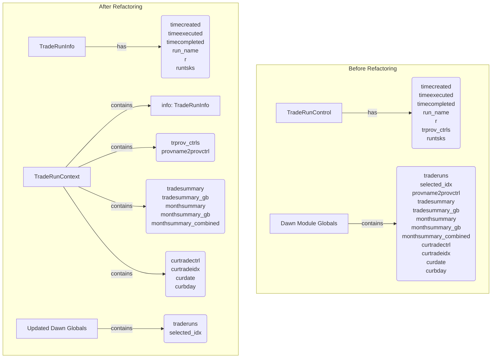
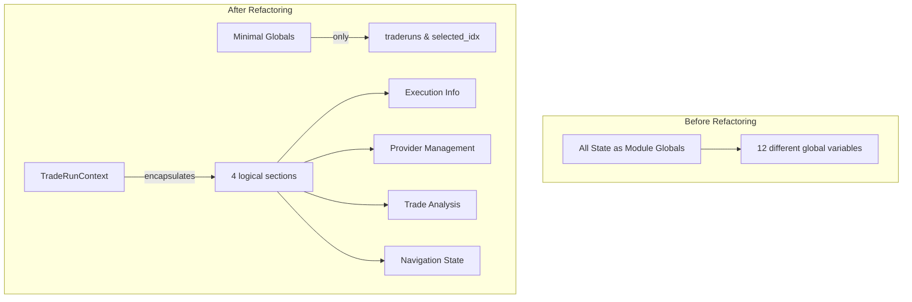
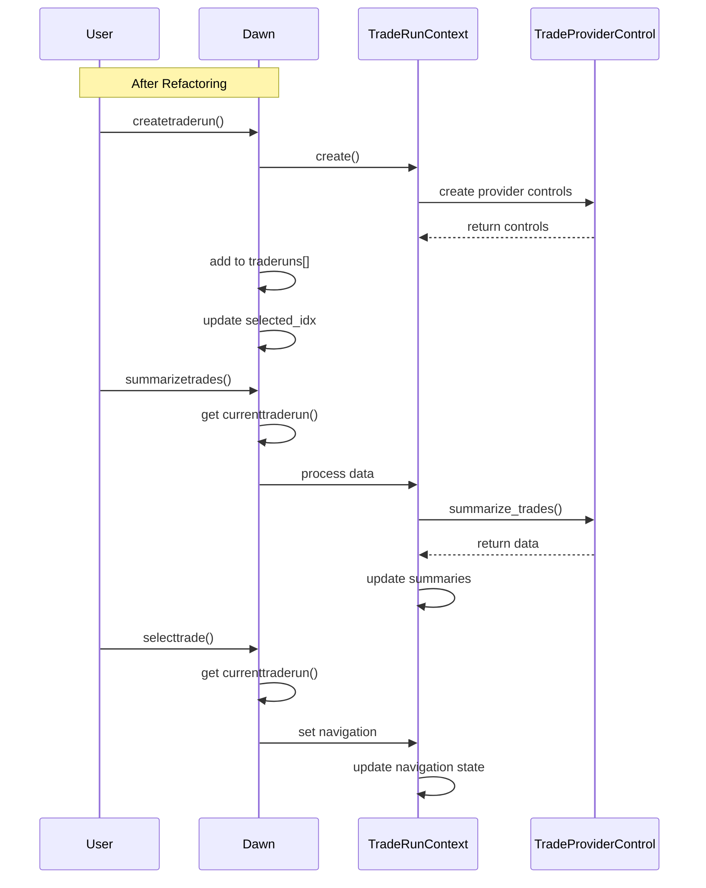
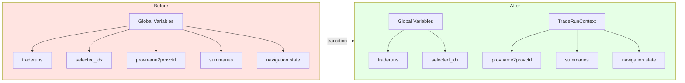
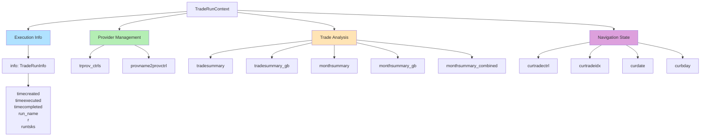
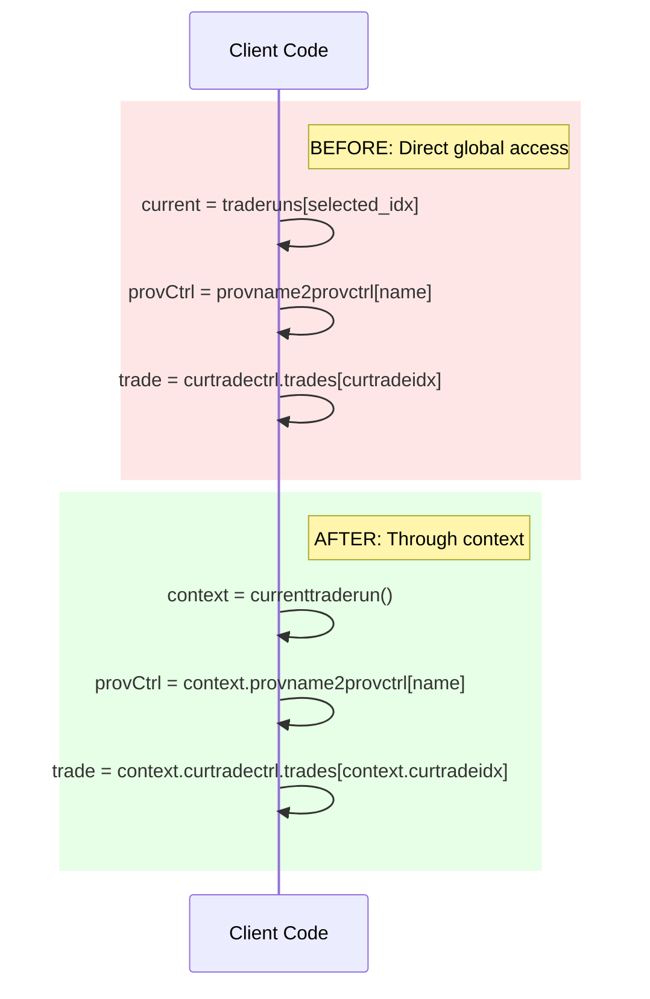

# TradeRunControl to TradeRunContext Refactoring Diagrams

## 1. Before and After Class Structure

## 2. State Organization

## 3. Function Data Flow

## 4. Global Variables Transition

## 5. TradeRunContext Structure

## 6. Access Pattern Changes

## 7. Overall Architecture

```mermaid
graph TB
    subgraph Dawn[Dawn Module]
        globals[Minimal Globals<br/>traderuns&#91;&#93;<br/>selected_idx]
        
        subgraph context[TradeRunContext Array]
            ctx1[Context 1]
            ctx2[Context 2]
            ctx3[Context N]
        end
        
        funcs[Module Functions<br/>createtraderun<br/>summarizetrades<br/>selecttrade<br/>etc]
    end
    
    subgraph context_detail[Each Context Contains]
        exec[Execution Info]
        prov[Provider Management]
        analysis[Trade Analysis]
        nav[Navigation State]
    end
    
    globals --> context
    context --> funcs
    funcs -.-> context_detail
```

These diagrams have been revised to use valid Mermaid syntax that should render properly in most environments. The changes include:

1. Using `graph` instead of `classDiagram` where appropriate
2. Removing quotes from class names that may cause parsing issues
3. Using simpler subgraph structures
4. Replacing some complex diagrams with more straightforward alternatives

All diagrams now focus on showing the structural and logical changes in the refactoring, rather than trying to represent exact class structure with properties and methods.

